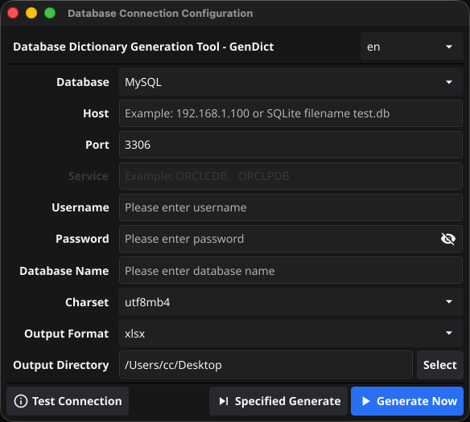
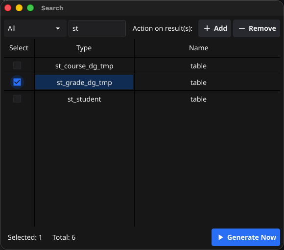

# 多数据库字典生成工具 (GenDict)

[中文](README.md) | [ENGLISH](README_EN.md)

[](https://golang.org/)
[](https://opensource.org/licenses/Apache-2.0)
[](https://github.com/ourcolour/GenDict/pulls)
[](https://gitee.com/ourcolour/GenDict)
[](https://github.com/ourcolour/GenDict)


一个使用Go语言开发的可视化数据字典生成工具，支持多种关系型数据库。该工具能够自动扫描数据库结构，生成详细的数据字典文档，并支持多种输出格式。





## ✨ 功能特性

- **多数据库支持**: 支持 MySQL、SQLServer、PostgresSQL、Oracle、SQLite 等多种主流关系型数据库
- **智能元数据提取**: : 自动解析数据库结构，精准提取表、字段、索引、约束、视图等元数据信息
- **灵活输出格式**: 支持将数据字典导出为 Excel、Markdown 等多种格式，方便查阅和集成
- **直观可视化界面**: 提供简洁易用的图形界面，无需编写复杂命令即可生成数据字典
- **原生高效性能**: 基于Go语言开发，编译为原生二进制文件，执行速度快，资源占用低
- **跨平台支持**: 支持Windows、Linux、macOS等多种操作系统，无需额外依赖环境

## 🚀 快速上手

⚠️ 重要提示: 使用本工具时，请确保遵守数据安全法规和公司政策，仅在获得授权的情况下访问数据库，并对生成的文档采取适当的安全保护措施。

### 前提条件

- Go 1.24+ 或更高版本（仅源码编译需要）
- 支持的目标数据库（MySQL、PostgresSQL、Oracle 或 SQLite）
- 数据库连接权限（建议在测试环境使用）

### 安装方式

#### **方式一：下载预编译二进制文件（推荐）**

从 Release 页面下载适用于您操作系统的最新预编译版本：
- Windows: GenDict_Windows_x86_64.zip
- Linux: GenDict_Linux_x86_64.tar.gz
- macOS: GenDict_macOS_x86_64.tar.gz

下载后解压即可使用，无需额外依赖。

#### **方式二：从源码编译安装**

```shell
# 克隆项目代码

git clone https://github.com/ourcolour/GenDict.git
cd GenDict

# 编译并安装
go mod download
go build -o gen-dict main.go

# 将可执行文件移动到 PATH 环境变量包含的目录中，例如
sudo mv gen-dict /usr/local/bin/
```

### 基本用法

1. 启动应用程序：
    ```shell
    gen-dict
    ```
2. 配置连接：在GUI界面中输入数据库连接信息
   - 主机地址、端口号
   - 数据库名称
   - 用户名和密码
   - 数据库类型（自动检测）
3. 设置输出：
   - 选择输出格式（Excel/Markdown）
   - 指定保存路径
4. 生成文档：点击"生成"按钮，等待完成后查看输出文件

## 📋 支持的数据库

当前工具支持以下数据库类型。

| 数据库        | 支持状态 | 版本要求 | 支持特新  |
|--------------|------|------|-------|
| MySQL      | ✅ 支持 | 5.7+ | 表、视图、索引、注释 |
| PostgresSQL | ✅ 支持 | 9.6+ | 表、视图、索引、注释 |
| Oracle     | ✅ 支持 | 11g+ | 表、视图、索引、注释 |
| SQLite     | ✅ 支持 | 3.0+ | 表、索引 |


## 🤝 参与贡献

我们热烈欢迎社区贡献！以下是参与方式：

### 如何贡献
- 报告问题: 提交 Issue反馈bug或建议
- 改进文档: 完善使用指南、API文档或翻译
- 代码贡献: 实现新功能或修复问题
- 测试帮助: 测试不同数据库兼容性或边缘情况

### 开发流程

1. Fork 本仓库并创建特性分支：
    ```shell
    git checkout -b feature/你的功能名称
    ```
2. 提交代码变更：
    ```shell
    git commit -m 'feat: 添加新功能描述'
    ```
3. 推送到分支并创建Pull Request：
    ```shell
    git push origin feature/你的功能名称
    ```
4. 等待代码审查和合并

### 代码规范

- 遵循Go语言官方代码规范
- 提交信息遵循Conventional Commits规范
- 确保新增代码包含适当测试用例
- 更新相关文档和示例

## 📄 许可证

本项目采用 Apache License 2.0 开源许可证。详情请参阅 [LICENSE](LICENSE) 文件。

## 🙏 致谢

谢所有为本项目做出贡献的开发者们，特别是：
- Go语言社区提供的优秀开发生态
- 各数据库驱动维护者
- 提交Issue和PR的贡献者们
- 给予反馈和建议的用户们

## ☎️ 联系与支持

如果您遇到问题或需要帮助：

- 查看 Wiki文档获取详细指南
- 提交 Issue报告问题
- 加入讨论区交流使用经验

⭐ 如果这个项目对您有帮助，请给我们一个星标！您的支持是我们持续开发的动力。⭐