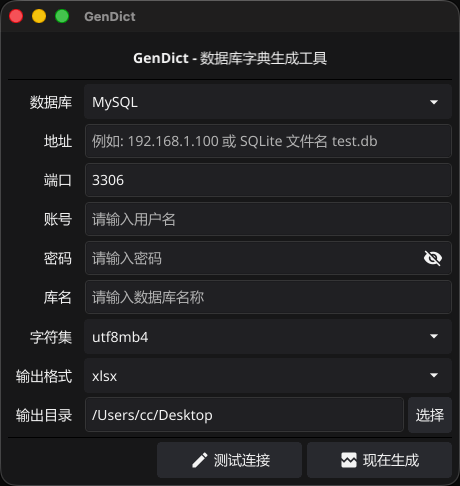
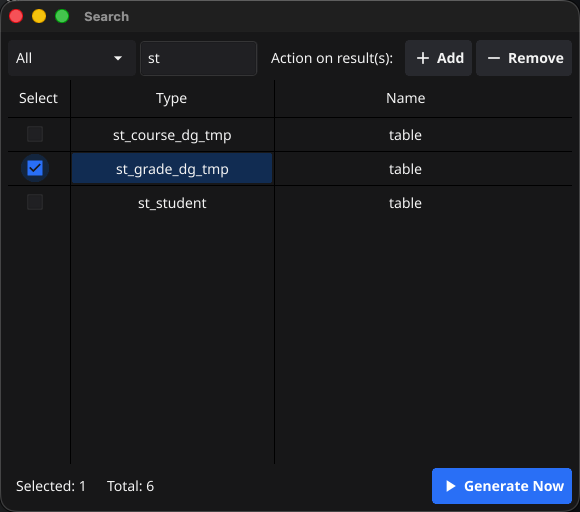

# Multi-Database Dictionary Generation Tool (GenDict)

[中文](README.md) | [ENGLISH](README_EN.md)

[](https://golang.org/)
[](https://opensource.org/licenses/Apache-2.0)
[](https://github.com/ourcolour/GenDict/pulls)
[](https://gitee.com/ourcolour/GenDict)
[](https://github.com/ourcolour/GenDict)


A visual data dictionary generation tool developed using the Go language, supporting various relational databases. This tool can automatically scan database structures, generate detailed data dictionary documents, and supports multiple output formats.





## ✨ Features

- **Multi-Database Support**: Supports various mainstream relational databases such as MySQL, SQLServer, PostgresSQL, Oracle, SQLite, and more.
- **Intelligent Metadata Extraction**: Automatically parses database structures and accurately extracts metadata information like tables, fields, indexes, constraints, views, etc.
- **Flexible Output Formats**: Supports exporting the data dictionary to multiple formats like Excel, Markdown, etc., for easy reference and integration.
- **Intuitive Visual Interface**: Provides a simple and easy-to-use graphical interface, allowing data dictionary generation without writing complex commands.
- **Native High Performance**: Developed with Go and compiled to native binaries for fast execution and low resource consumption
- **Cross-Platform Support:**: Supports Windows, Linux, macOS, and other operating systems with no additional dependencies required

## 🚀 Quick Start

⚠️ Important Note: When using this tool, please ensure compliance with data security regulations and company policies. Access databases only with proper authorization and apply appropriate security measures to the generated documents.

### Prerequisites

- Go 1.24+ or higher (required only for source code compilation)
- Supported target database (MySQL, PostgresSQL, Oracle, or SQLite)
- Database connection permissions (recommended for use in test environments)

### Installation Methods

#### **Option 1: Download Pre-compiled Binary (Recommended)**

Download the latest pre-compiled version for your operating system from the Releases page:
- Windows: GenDict_Windows_x86_64.zip
- Linux: GenDict_Linux_x86_64.tar.gz
- macOS: GenDict_macOS_x86_64.tar.gz

After downloading, extract and use it directly without additional dependencies.

#### **Option 2: Compile and Install from Source**

```shell
# Clone the project code

git clone https://github.com/ourcolour/GenDict.git
cd GenDict

# Compile and install
go mod download
go build -o gen-dict main.go

# Move the executable to a directory included in the PATH environment variable, e.g.
sudo mv gen-dict /usr/local/bin/
```

### Basic Usage

1. Start the application：
    ```shell
    gen-dict
    ```
2. Configure connection: Enter the database connection information in the GUI interface
    - Host address, port number
    - Database name
    - Username and password
    - Database type (auto-detected)
3. Set output:
    - Select output format (Excel/Markdown)
    - Specify the save path
4. Generate document: Click the "Generate" button, wait for completion, and then check the output file

## 📋 Supported Databases

The current tool supports the following database types.

| Database   | Status       | Vesion Requirement | Supported Features               |
|------------|--------------|--------------------|----------------------------------|
| MySQL      | ✅ Supported | 5.7+               | Tables, Views, Indexes, Comments |
| SQLServer  | ✅ Supported | 2008+              | Tables, Views, Indexes, Comments |
| PostgreSQL | ✅ Supported | 9.6+               | Tables, Views, Indexes, Comments |
| Oracle     | ✅ Supported | 11g+               | Tables, Views, Indexes, Comments |
| SQLite     | ✅ Supported | 3.0+               | Tables, Views                    |

## 🤝 Contributing

We warmly welcome community contributions! Here's how you can participate:

### How to Contribute
- Report Issues: Submit an Issue to report bugs or suggestions.
- Improve Documentation: Enhance user guides, API documentation, or translations.
- Code Contributions: Implement new features or fix issues.
- Testing Assistance: Test compatibility with different databases or edge cases.

### Development Process

1. Fork this repository and create a feature branch:
    ```shell
    git checkout -b feature/your-feature-name
    ```
2. Commit your changes:
    ```shell
    git commit -m 'feat: add description of the new feature'
    ```
3. Push to the branch and create a Pull Request:
    ```shell
    git push origin feature/your-feature-name
    ```
4. Wait for code review and merge

### Code Standards
- Follow the official Go language code specifications.
- Commit messages should follow the Conventional Commits specification.
- Ensure new code includes appropriate test cases.
- Update relevant documentation and examples.

## 📄 License

This project is licensed under the Apache License 2.0. For details, please see the [LICENSE](LICENSE) file.

## 🙏 Acknowledgements

Thanks to all the developers who have contributed to this project, especially:
- The Go language community for providing an excellent development ecosystem.
- Maintainers of various database drivers.
- Contributors who submitted Issues and PRs.
- Users who provided feedback and suggestions.

## ☎️ Contact & Support

If you encounter problems or need help:
- Check the Wiki documentation for detailed guides.
- Submit an Issue to report problems.
- Join the discussion forum to share usage experiences.

⭐ If this project is helpful to you, please give us a star! Your support is the motivation for our continued development. ⭐